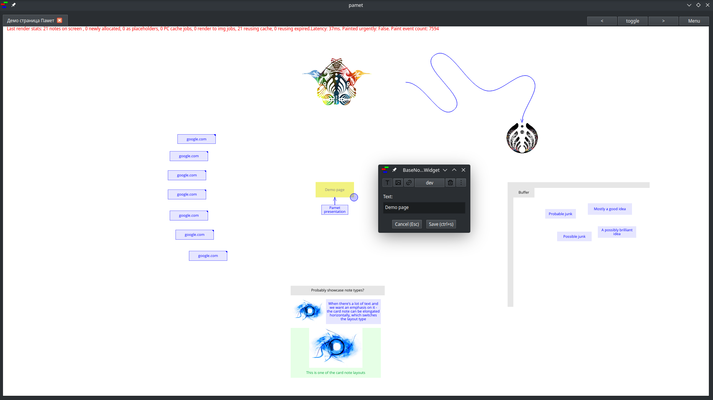

# Pamet
An app for organizing thoughts and notes.

**Still in alpha** - you'll probably encounter GUI bugs, but the data storage/saving is stable.

## Installation
Currently installation is possible from pypi/pip and via a windows static build ([download it on the releases page](https://github.com/v-ko/pamet/releases/)).

### Via pip
`pip install pamet` , start with `pamet`

### From source
- Clone the [Fusion](https://github.com/v-ko/fusion) and Pamet repos.
- Run `pip install .` (with the respective repo as current working dir).
    * If you want a development install run `pip install -e .` instead. Install Fusion first (otherwise it'll get pulled from PyPI). Also it would be best to do it in a virtual environment if you want to run the release version in parallel

- A submission in the windows store is pending
- A Flatpak is in the works but I hit an [issue](https://github.com/flatpak/flatpak/issues/5103) there.

## Usage
- Ctrl+shift+P for the command palette
- Double click to create a new note
- Click to select
- Long-press to initiate move
- Ctrl or shift to select multiple notes
- Ctrl+Shift to drag-select multiple notes
- Drag the lower right corner of a note to resize it
- Buttons 1,2,3,4 change the note color. 5 removes the background
* Selected notes get moved together and resized to the same size
* No manual saving is required
- Copy/paste/cut work as you'd expect
- Paste special with ctrl+shift+V (imports links and multiple notes) - will be improved

## Testing
There are unit tests for some of the functionality and testing for the actions(=controller) which are not presize but are quite useful for visual verification (+are [quite easy to generate](tests/actions/new_test_HOW_TO.md)).

## Development state and future
Check some notes on the [development so far](development-history.md)

Currently the code documentation isn't updated, and typing annotations have to be completed in places.

Next goals in terms of features:
- Server for page sharing
- A minimal web app for viewing pages
- A minimal android app for viewing and limited input
