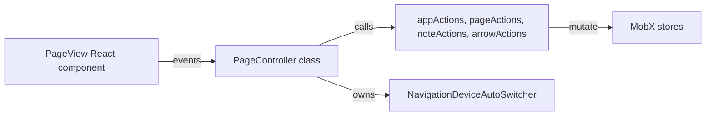

# PageView Controller Extraction Plan

Goal: Abstract input orchestration from the React view while keeping MobX actions and state unchanged.

Pattern summary:
- Thin view, controller orchestrator, stable instance via ref, optional lifecycle hook later.

Current anchors:
- [PageView()](pamet/web-app/src/components/page/PageView.tsx:38)
- [class PageController()](pamet/web-app/src/components/page/PageView.tsx:30)
- Handlers to consider:
  - [handleMouseLeave](pamet/web-app/src/components/page/PageView.tsx:490)
  - [handleMouseEnter](pamet/web-app/src/components/page/PageView.tsx:499)
  - [handleWheel](pamet/web-app/src/components/page/PageView.tsx:375)
  - [handleMouseDown](pamet/web-app/src/components/page/PageView.tsx:186)
  - [handleMouseMove](pamet/web-app/src/components/page/PageView.tsx:219)
  - [handleMouseUp](pamet/web-app/src/components/page/PageView.tsx:300)
  - [handleDoubleClick](pamet/web-app/src/components/page/PageView.tsx:535)
  - [handleTouchStart](pamet/web-app/src/components/page/PageView.tsx:410)
  - [handeTouchMove](pamet/web-app/src/components/page/PageView.tsx:439)
  - [handleTouchEnd](pamet/web-app/src/components/page/PageView.tsx:482)
  - Drag and drop:
    - [handleDragEnter](pamet/web-app/src/components/page/PageView.tsx:582)
    - [handleDragLeave](pamet/web-app/src/components/page/PageView.tsx:600)
    - [handleDragOver](pamet/web-app/src/components/page/PageView.tsx:607)
    - [handleDrop](pamet/web-app/src/components/page/PageView.tsx:611)

Architecture diagram:

Incremental plan:

1. Introduce a stable controller instance in [PageView()](pamet/web-app/src/components/page/PageView.tsx:38)
   - Hold a single PageController instance in a ref created once on mount.
   - Provide the instance to the component scope via a local constant for readability.

2. Migrate one small input to the controller now
   - Move logic from [handleMouseLeave](pamet/web-app/src/components/page/PageView.tsx:490) into a controller method.
   - Update JSX prop [onMouseLeave](pamet/web-app/src/components/page/PageView.tsx:663) to call the controller method, forwarding the React event and appViewState.

3. Keep behavior identical
   - The controller method must delegate to appActions.updateMouseState and must not alter page mode beyond current logic.

4. Next extractions (follow-up)
   - Centralize NavigationDeviceAutoSwitcher ownership in the controller; remove local state at [useState(new NavigationDeviceAutoSwitcher())](pamet/web-app/src/components/page/PageView.tsx:51).
   - Move [handleWheel](pamet/web-app/src/components/page/PageView.tsx:375) to the controller and delegate to pageActions.updateViewport and related actions.
   - Move hover and enter pair [handleMouseEnter](pamet/web-app/src/components/page/PageView.tsx:499) to the controller to co-locate with leave.
   - Then migrate drag families in small steps: down, move, up.

Acceptance criteria:
- Page renders and behaves the same.
- Controller instance is created exactly once per mount.
- No duplication of NavigationDeviceAutoSwitcher once centralized.

Out of scope for this step:
- Moving the controller to its own file; will be done after proving in-place.

Decision needed to proceed:
- Which small handler to migrate first? Recommendation: [handleMouseLeave](pamet/web-app/src/components/page/PageView.tsx:490). Alternatives: [handleDragOver](pamet/web-app/src/components/page/PageView.tsx:607), [handleDragEnter](pamet/web-app/src/components/page/PageView.tsx:582), [handleDragLeave](pamet/web-app/src/components/page/PageView.tsx:600).
