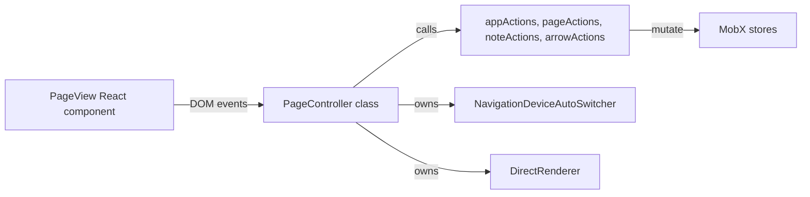

# PageView Controller Extraction Plan

**Goal**: Abstract input orchestration from the React view while keeping MobX actions and state unchanged. This improves separation of concerns and simplifies the view component.

## Architecture

-   **View**: A thin React component (`PageView.tsx`) responsible only for rendering.
-   **Controller**: A plain TypeScript class (`PageController.tsx`) that handles all user input, orchestrates actions, and manages local UI state. It is instantiated once per `PageView` mount and held in a `useRef`.
-   **Actions & State**: MobX actions and stores remain the source of truth for application state.

## Migration Progress

The following event handlers are being migrated from `PageView.tsx` to `PageController.tsx`.

### Mouse Events
- [x] `handleMouseLeave`
- [x] `handleMouseEnter`
- [x] `handleWheel`
- [x] `handleMouseDown`
- [x] `handleMouseMove`
- [x] `handleMouseUp`
- [x] `handleDoubleClick`
- [x] `handleContextMenu`

### Touch Events
- [ ] `handleTouchStart`
- [ ] `handeTouchMove`
- [ ] `handleTouchEnd`

### Drag and Drop Events
- [ ] `handleDragEnter`
- [ ] `handleDragLeave`
- [ ] `handleDragOver`
- [ ] `handleDrop`

### Other Logic
- [ ] `ResizeObserver` (Remove redundant code from `PageView.tsx`)

## Diagnosis: Page switching bug (controller holds stale state)

Symptoms observed in runtime logs:
- The React view renders with a new PageViewState id while DirectRenderer continues to log renders for the old PageViewState id, and repeated "Binding/Unbinding events" occurs during page switches.
- Example: Direct renderer logs use a previous pageVS id after appActions.setCurrentPage, indicating the controller/render path still references the previous state instance.

Root cause:
- The controller instance is created once and captures the PageViewState passed on first mount. On later page switches (appActions.setCurrentPage creates a brand-new PageViewState), the PageView React component receives the new state, but the existing controller continues to hold the old PageViewState reference. Its MobX reaction and DirectRenderer therefore render and react to the old state.
- Additionally, there are two ResizeObserver sources updating geometry:
  - One in the controller (setupResizeObserver)
  - One in the React view (PageView.tsx)
  This duplication can cause redundant updates and extra re-bind cycles.

Impact:
- Stale reactions and renderer state after page change.
- Redundant geometry updates and extra event binding/unbinding churn.

## Remediation plan (actionable TODO list)

1) Recreate controller on page change
   - Replace the controllerRef singleton pattern in [PageView.tsx](pamet/web-app/src/components/page/PageView.tsx) with a memoized controller tied to the current PageViewState.
   - Use React memoization keyed by the PageViewState identity to ensure a fresh controller is created when the page changes.
   - Bind/unbind events in a single effect that depends only on the memoized controller instance.

2) Remove duplicate ResizeObserver from React view
   - Delete the updateGeometryHandler and the ResizeObserver effect in [PageView.tsx](pamet/web-app/src/components/page/PageView.tsx).
   - Rely exclusively on PageController.setupResizeObserver for canvas sizing and viewportGeometry updates.

3) Keep renderer and reactions aligned with the live PageViewState
   - By recreating the PageController per state change, the internal MobX reaction and DirectRenderer will be registered against the new PageViewState instance.
   - This avoids having to add ad-hoc “updatePageVS” plumbing and ensures new reaction dependencies are tracked correctly.

4) Validation and logs
   - After changes, verify logs:
     - On page switch: exactly one "Unbinding events from PageViewController" for the previous instance, then one "Binding events to PageViewController" for the new instance.
     - DirectRenderer should log the same PageViewState id as the React view for all subsequent renders.
     - Viewport geometry changes should log once per resize from the controller side only.
   - Confirm touch/drag behaviors continue to work as before (they still live in PageView.tsx for now).

5) Follow-up improvements (optional, after fix)
   - Migrate touch and drag-and-drop handlers from [PageView.tsx](pamet/web-app/src/components/page/PageView.tsx) into [PageController.tsx](pamet/web-app/src/components/page/PageController.tsx) per the existing plan.
   - Consider marking third-party event listeners as passive where possible. The current Chrome Violation stems from paper.js; we can’t fix their internal listener, but our own handlers should be passive where feasible.

## Test checklist

- Switch between pages multiple times:
  - The bound controller/renderer always reflects the current PageViewState id.
  - No lingering reactions firing for the old state.
  - No duplicate geometry updates; canvas dimensions match container at current DPR.
- Interactions:
  - Drag navigation, selection, moving/resizing notes, arrow editing still work.
- Performance:
  - No repeated binding churn beyond the required unbind/bind per page switch.

## Rollback plan

- If any regression is observed, revert only the PageView.tsx changes to restore previous behavior, then re-attempt with controller recreation isolated to page state change logic.

## Phase 2 Diagnosis and Fix Plan

Observation from new logs:
- After setCurrentPage a new PageViewState is created and DirectRenderer now logs the same pageVS id as React. So the stale-controller issue is largely addressed.
- We still see multiple bind/unbind cycles and duplicate geometry updates during mount. In React 18 dev, useEffect mounts are intentionally double-invoked under StrictMode, causing one immediate unmount/remount. Our logs reflect this expected behavior.
- We also see repeated paper.js setup warnings and multiple [Violation] notices, likely due to re-setup of paper on the same canvas when the page changes.

Residual issues to fix:
1) Ensure all resources from the previous render pipeline are deterministically disposed on unbind:
   - Cancel any pending requestAnimationFrame to prevent late renders referencing disposed state.
   - Release cached ImageBitmaps in DirectRenderer to avoid memory/logic leaks across page switches.
2) Make paper.js setup idempotent across page switches:
   - Avoid re-running paper.setup for the same canvas on page state changes.
   - Add a cleanup to clear/remove the paper project on unmount if needed.
3) Reduce noisy or redundant geometry updates on initial bind:
   - We already call compute() once in setupResizeObserver; duplicate updates that persist are from StrictMode. We will keep behavior correct but minimize unintended double listeners.

Actionable TODOs:
- [ ] Add dispose() to DirectRenderer to cancel RAF and clear cached ImageBitmaps, and call it from PageController.unbindEvents.
- [ ] In PageController.unbindEvents, after removing listeners and disconnecting ResizeObserver, call renderer.dispose() and set this._renderer = undefined.
- [ ] Update paper setup effect in [PageView.tsx](pamet/web-app/src/components/page/PageView.tsx) to:
      - Depend only on the canvas ref to avoid re-setup on page state changes.
      - Add cleanup that clears the project and removes the Paper.js scope to prevent leaks.
- [ ] Keep controller creation per-page state as implemented (useMemo keyed by PageViewState) and keep ResizeObserver exclusively in controller.

Validation checklist:
- On page switches: one unbind then one bind per switch (still doubled during dev StrictMode, but no duplicate listeners remain afterward).
- DirectRenderer logs always match the current PageViewState id.
- No stray renders or cache usage from previous page after switching.
- Paper.js warnings do not multiply with repeated page switches.

Notes:
- Some duplicate effect activity in development is expected with React StrictMode; the goal is to make event binding and resource lifecycle idempotent and safe under double-invocation.
